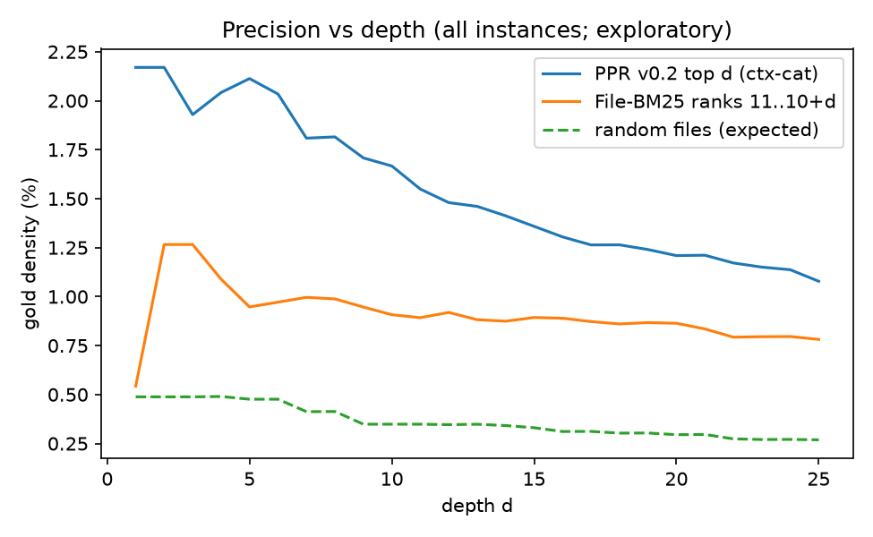
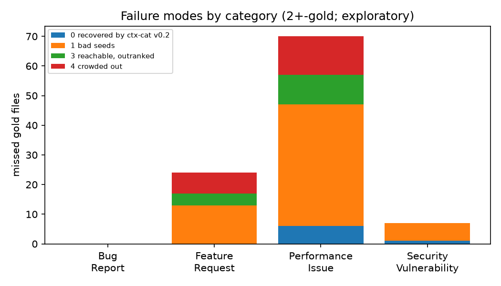
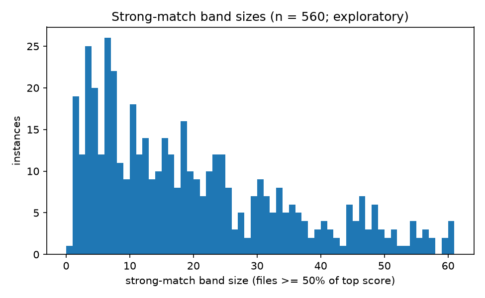
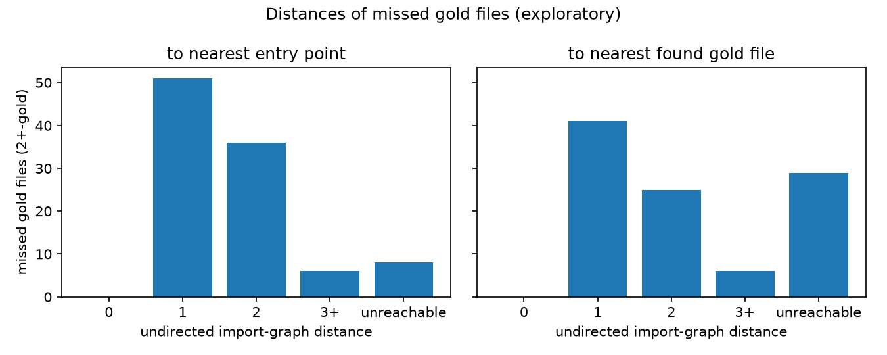
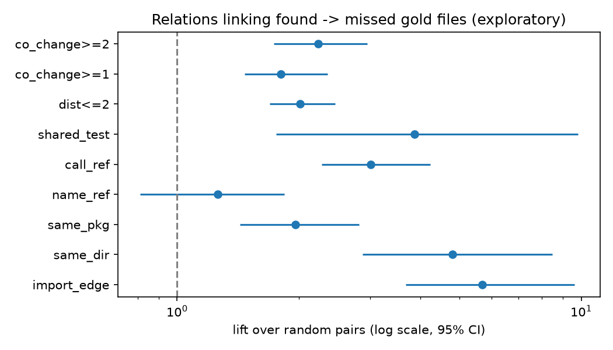

# What each retrieval component suggested on Loc-Bench, and why the graph did not add value

> **Exploratory, post-hoc analysis.** Everything here was decided after seeing the Loc-Bench results. It explains
> the frozen run; it is not a benchmark result, and nothing in it may be used to claim an improvement. Many
> comparisons are made and none is corrected for multiplicity. Scope: Loc-Bench V1, variant B (non-test
> files), Rhizome at tag `v0.2.0-rc1` (both `[v0.1]` = `RetrievalConfig.v01()` and `[v0.2]` retrieval).

Generated artefacts: `TABLES.md` (all tables), `tables/*.csv`, `figures/*.png`, `results.json`, `CASES.md`;
raw traces in `data/` (`trace.py`, `relations.py`, `analyse.py` reproduce everything).

## 1. Summary

Numbers are point estimates with 95% instance-bootstrap intervals (10,000 resamples, seed 0) unless stated.

1. **The trace reproduces the run exactly.** All 560 instances were re-traced with the frozen tag; the traced
   rankings of all 13 methods matched the saved top 100 for **560 of 560** instances, so no instance is excluded.
2. **The graph contributes very few of the gold files that reach the top 10.** Of the 521 gold files that
   `rhizome-ctx-cat [v0.2]` puts in its top 10, 413 come from entry points, 85 from the strong-match band,
   **18 (3.5%) from personalized PageRank (PPR)** and 5 from the BM25 fallback.
3. **PPR's candidates are better than random, but not better than the BM25 files they would displace once
   you remove what BM25 already found.** PPR's top 25 holds gold at 1.2% [1.0, 1.4] against 0.8% [0.6, 1.0] for
   File-BM25 ranks 11-35 (lift 1.49 [1.23, 1.83]) and 3.2x [2.7, 4.0] the random rate. But restricted to files
   **not already in BM25's top 10**, the lift over the displaced BM25 ranks is **0.85 [0.69, 1.04]**: no extra signal.
   The graph mostly re-finds neighbours of files text search already ranks highly.
4. **Walking the graph from BM25's top 4 (`bm25-graph`) is noise relative to what it displaces:** its walk items
   hold gold at 0.3% vs 0.7% for the BM25 ranks 5+ they push down, **lift 0.42 [0.35, 0.50]**.
5. **The graph's best-case headroom is smaller than simply taking more BM25 results.** With perfect selection,
   BM25 top 10 + PPR top 25 reaches recall@10 of **83.4% [80.4, 86.3]**; BM25's own top 35 reaches
   **87.1% [84.4, 89.7]** (actual BM25 recall@10: 74.6%).
6. **On multi-file instances, most misses start from the wrong place.** Of the 101 gold files that File-BM25
   misses in its top 10 on 2+-gold instances: **bad seeds 59.4% [45.0, 72.7]** (no gold file among the v0.2
   entry points), crowded out 19.8% [11.0, 29.7], reachable but outranked 13.9% [6.2, 22.8], recovered by v0.2
   context 6.9% [2.7, 12.2]. Unreachability is rarely the cause: only 9 of 101 are more than 3 hops from every
   entry point.
7. **The strong-match band is large and does not depend on issue length.** Median band size is 20 files (90th
   percentile 82); 86% of instances have more than 4 strong matches, so the never-demote rule fills the top 10
   before any PPR file can enter. Band size is not correlated with query length (Spearman rho = 0.04, p = 0.32,
   n = 560): the "long issues flatten scores" explanation is **not supported**.
8. **PPR mass flows to hubs.** 39.3% [38.4, 40.3] of PPR mass (outside the entry points) lands on hub files (top 5%
   fan-in or `__init__.py`), despite hub down-weighting. Gold files are less connected than the non-gold files
   PPR proposes (median degree 14 vs 19; Mann-Whitney p = 9e-20).
9. **The import graph already links most missed gold files; other links add less.** For missed gold files on
   2+-gold instances (73 with a found gold partner, 42 instances), a direct import edge to a found gold file
   exists for 41 (lift 5.7 [3.7, 9.6] over random pairs). The strongest additional relations are **same
   directory** (lift 4.8 [2.9, 8.5], connects 29), **shared test file** (3.9 [1.8, 9.8], 14) and **call
   relation** (3.0 [2.3, 4.2], 47); **co-change** (2+ shared commits) is weaker (2.2 [1.7, 3.0], 49) and bare name
   references without an import carry no signal (1.26 [0.81, 1.84]).
10. **v0.2's gain over BM25 is small and comes from the name field.** Gold files rank better under v0.2 search
    than under File-BM25 (Wilcoxon p = 3.8e-6, n = 731; both medians 3). In the top 10 they disagree on 25 gold
    files (19 in v0.2's favour); where v0.2 wins, the path/symbol-name field supplies 17% [13, 21] of the gold
    file's score, against 7% [1, 14] where it loses (n = 19 and 6, so this is weak).

## 2. Data and method

- **Run analysed:** `bench/runs/locbench-v01/` (560 instances, 165 repositories; 73 instances re-run after the two
  harness fixes documented in `bench/CHANGES.md`). Variant B only.
- **Frozen code:** tag `v0.2.0-rc1`, checked out as a separate worktree (`bench/.cache/wt-rc1`); `trace.py`
  imports Rhizome from there and asserts it. Both the `[v0.1]` and `[v0.2]` rows of the run came from this tag
  (`[v0.1]` = `RetrievalConfig.v01()` on the same bundle), so the `main` commit was not needed.
- **What was recomputed:** snapshots (from the local clones) and bundles (the cached zips that produced the run;
  nothing was re-scanned). Final items and their reasons come from the tag's own `gather()`. Internals that
  `gather()` does not return were recomputed with the tag's functions: the v0.2 entry threshold, the strong-match
  band, the full PPR candidate list (mass, text score, combined score), the v0.1 and `bm25-graph` walks, the
  BM25F name / doc / body contributions (checked: they sum to the search score), graph distances, and relation
  features. Co-change counts use `git log <base_commit> -- <file>` only (history up to the base commit).
- **Integrity:** for every instance all 13 rankings (top 100) were rebuilt and compared with the saved ones;
  all 560 matched, and PPR items in the final rankings were checked to be a subset of the recomputed PPR top 25.
  All 731 gold files are in the bundles and parsed with `ast` (the 160 files that needed tree-sitter in the run
  include no gold file); no gold file is a test file.
- **Statistics:** instance-level bootstrap (10,000 resamples, seed 0) for ratios, lifts and means; exact McNemar,
  Wilcoxon signed-rank (paired ranks), Mann-Whitney (unpaired degrees), Spearman (band size vs query length).

## 3. Results

### B. Provenance: which component found each gold file

Gold files (n = 731) by whether they are in File-BM25's top 10, `rhizome-search [v0.2]`'s top 10, and a graph
component's own list (PPR ranks 1-10; the first 10 v0.1 walk/extra items; the first 10 `bm25-graph` walk items):

| Found by | Graph top 10 | Graph any depth |
|---|---:|---:|
| BM25 + search | 402 | 343 |
| all three | 112 | 171 |
| graph only | 63 | 131 |
| search v0.2 only | 13 | 7 |
| search + graph | 6 | 12 |
| BM25 + graph | 3 | 5 |
| BM25 only | 3 | 1 |
| none | 129 | 61 |

Only **10** gold files are in a graph component's top 10 while absent from File-BM25's entire top 100 (26 at any
depth). So graph-only discoveries exist but are rare, and they rarely survive into a final top 10:

| Final ranking | Gold files in top 10, by the component that put them there |
|---|---|
| `rhizome-ctx-cat [v0.2]` | entry points 413, strong band 85, **PPR 18**, BM25 fallback 5 |
| `rhizome-ctx-cat [v0.1]` | entry points 311, dependency walk 66, caller walk 11, subsystem members 16, fallback 23 |
| `bm25-graph` | BM25 top 4 407, **walk 47**, fallback 9 |

### C. Signal vs noise of each component's candidate list

| Component list (all 560 instances) | Precision % | Displaced BM25 ranks % | Lift vs displaced | Lift vs random |
|---|---|---|---|---|
| PPR v0.2 top 5 | 2.1 [1.5, 2.8] | 1.0 [0.6, 1.4] | 2.13 [1.38, 3.41] | 4.33 [3.26, 5.97] |
| PPR v0.2 top 10 | 1.8 [1.4, 2.2] | 0.9 [0.7, 1.2] | 1.92 [1.42, 2.68] | 3.99 [3.09, 5.36] |
| PPR v0.2 top 25 | 1.2 [1.0, 1.4] | 0.8 [0.6, 1.0] | 1.49 [1.23, 1.83] | 3.22 [2.68, 4.02] |
| **PPR top 25, only files not in BM25 top 10** | 0.7 [0.5, 0.9] | 0.8 [0.6, 1.0] | **0.85 [0.69, 1.04]** | 2.21 [1.72, 2.89] |
| v0.1 walk + extras | 0.6 [0.5, 0.8] | 0.5 [0.4, 0.6] | 1.40 [1.13, 1.76] | 3.83 [3.25, 4.56] |
| **bm25-graph walk** | 0.3 [0.2, 0.4] | 0.7 [0.6, 0.8] | **0.42 [0.35, 0.50]** | 2.32 [2.04, 2.63] |

"Displaced" = File-BM25 ranks 11.. of the same count (for `bm25-graph`, ranks 5.., which its walk replaces). The
pattern holds for 1-gold and 2+-gold instances and in every category (full table in `TABLES.md`): graph lists are
better than random in almost every row (lift 1.5-15), but their precision on files BM25 has not already found is no better than BM25's next
ranks. On 2+-gold instances PPR's top 5 is richer (8.7% [5.8, 11.9]), yet again the new-files-only lift is
0.90 [0.67, 1.15].

### D. Complementarity and the upper bound

| Pool (perfect selection) | Recall % |
|---|---|
| File-BM25 @10 (actual) | 74.6 [71.1, 78.0] |
| BM25 top 10 + PPR 25, best 10 | 83.4 [80.4, 86.3] |
| BM25 top 35, best 10 | 87.1 [84.4, 89.7] |
| File-BM25 @20 (actual) | 79.8 [76.6, 83.0] |
| BM25 top 20 + PPR 25, best 20 | 85.6 [82.8, 88.4] |
| BM25 top 45, best 20 | 88.8 [86.3, 91.3] |

Spending 25 extra slots on BM25's next results offers more headroom than spending them on PPR. On 2+-gold
instances, 25 of the 71 gold files that BM25 misses in its top 20 are in PPR's top 25: real, but not enough
to beat BM25's own tail.

### E. Why the graph did not help: failure modes

2+-gold instances; each gold file File-BM25 misses in its top 10 gets exactly one primary reason, in the order
given (n = 101 gold files in 52 instances):

| Mode | Gold files | % [95% CI] |
|---|---:|---|
| 1 Bad seeds (no gold among the v0.2 entry points) | 60 | 59.4 [45.0, 72.7] |
| 4 Crowded out (in PPR's top 25, pushed beyond the top 10 by the strong band) | 20 | 19.8 [11.0, 29.7] |
| 3 Reachable, outranked (within 3 hops, PPR rank > 25) | 14 | 13.9 [6.2, 22.8] |
| 0 Recovered by `rhizome-ctx-cat [v0.2]` (not a failure) | 7 | 6.9 [2.7, 12.2] |
| 2 Unreachable (primary) | 0 | – |

"Unreachable" is 0 as a primary reason only because bad seeds are checked first; by distance alone, 9 of the 101
are more than 3 hops from every entry point or disconnected. Bad seeds dominate for performance issues (41 of 70)
and feature requests (13 of 24). Bug reports have no 2+-gold instances. `scikit-learn` alone contributes 6
outranked and 6 crowded-out files (per-repository table in `TABLES.md`). For the 14 outranked files the
competing PPR candidate lists are long (see `tables/E_outranked_detail.csv`).

 

**Band size.** Median 20 strong matches (90th percentile 82, max 427); 86.2% of instances have more than 4, which
means the four entry points plus the band usually fill the top 10 before PPR can place anything. Band size is
unrelated to the number of query tokens (rho = 0.043, p = 0.315, n = 560).

### F. Graph distances

Missed gold files on 2+-gold instances (n = 101):

| Distance from | 1 | 2 | 3+ | unreachable |
|---|---:|---:|---:|---:|
| nearest v0.2 entry, undirected | 51 | 36 | 6 | 8 |
| nearest entry, dependency direction | 34 | 14 | 13 | 40 |
| nearest entry, caller direction | 26 | 12 | 25 | 38 |
| nearest found gold, undirected | 41 | 25 | 6 | 29 |
| nearest found gold, dependency direction | 31 | 10 | 9 | 51 |
| nearest found gold, caller direction | 14 | 5 | 16 | 66 |

86% of missed gold files are within 2 undirected hops of an entry point, but only 48% along the dependency
direction the `bug` walk prefers: direction-aware weighting points the walk the wrong way about half the time.
Hub share of PPR mass is 39.3% [38.4, 40.3] (n = 553 instances with PPR). Gold files have lower degree than the
non-gold files PPR proposes (median 14 vs 19; p = 9e-20).

### G. Which other kinds of link would have connected the missed files

Found gold -> missed gold pairs vs found gold -> 10 random non-gold candidates (same instance), 42 instances,
73 missed gold files with a found partner:

| Relation | Gold pairs % | Random pairs % | Lift [95% CI] | Missed gold connected |
|---|---:|---:|---|---:|
| import edge (existing graph) | 49.1 | 8.6 | 5.69 [3.68, 9.64] | 41 / 73 |
| same directory | 34.0 | 7.1 | 4.80 [2.88, 8.48] | 29 / 73 |
| shared test file | 16.0 | 4.2 | 3.86 [1.76, 9.82] | 14 / 73 |
| call relation (ast) | 56.6 | 18.8 | 3.02 [2.28, 4.23] | 47 / 73 |
| co-change, 2+ commits | 60.4 | 27.1 | 2.23 [1.74, 2.95] | 49 / 73 |
| within 2 import hops | 85.8 | 42.6 | 2.01 [1.69, 2.46] | 66 / 73 |
| same top-level package | 45.3 | 23.1 | 1.96 [1.43, 2.82] | 37 / 73 |
| co-change, 1+ commit | 79.2 | 43.8 | 1.81 [1.47, 2.36] | 62 / 73 |
| name reference without import | 27.4 | 21.7 | 1.26 [0.81, 1.84] | 25 / 73 |

The existing import edge is already the most selective link, and it connects more than half of the missed files
to a gold file BM25 found. The graph's problem on these instances is where it starts (section E), not which
edges it has.

### H. Where `rhizome-search [v0.2]` differs from File-BM25

| k | v0.2 has the gold file, BM25 not | BM25 has it, v0.2 not |
|---|---:|---:|
| top 5 | 27 | 14 |
| top 10 | 19 | 6 |

Gold-file ranks are better under v0.2 (Wilcoxon signed-rank p = 3.77e-6, n = 731). Where v0.2 wins in the
top 10, the name field (path and symbol names, weight 3) contributes 17% [13, 21] of the gold file's BM25F score;
where it loses, 7% [1, 14]. The name field helps when the file's path or definitions are named in the issue;
otherwise BM25F behaves like whole-file BM25. Per-file detail: `tables/H_disagreements.csv`.

### I. Case studies

Full sheets (issue, gold files, every component's top 10 with gold in bold, graph paths): `CASES.md`.

**Graph added a gold file to the top 10**

1. `Agenta-AI__agenta-1639` (performance). The issue is a slow `get_config` endpoint. BM25 finds 2 of 3 gold
   files. `models/converters.py` is imported by `services/db_manager.py` (BM25's #1), so the `bm25-graph` walk puts
   it at #7. PPR ranks it 9th, but v0.2's strong band has 40 files, so it is crowded out of the v0.2 top 10.
2. `AzureAD__microsoft-authentication-library-for-python-454` (performance, lazy imports). BM25's top 10 is
   mostly `sample/` scripts. `msal/authority.py` is imported by `msal/application.py` (#1); the walk adds it at #7
   and `oauth2cli/assertion.py` at #9. PPR ranks two gold files 2nd and 5th, but the band (16) again fills v0.2's
   top 10.
3. `Deltares__imod-python-1159` (performance). `imod/typing/grid.py` is one import from `regrid.py`; the walk puts
   it at #5, but in the same instance the walk pushes out two other gold files (case 8): net -1.
4. `Innopoints__backend-124` (security, "Implement CSRF protection"). Only one strong match (band 1), so PPR fills
   v0.2's top 10 and brings in `views/account.py` and `core/helpers.py`, while BM25's `blueprints.py` drops out.
   The graph helps when the band is small.

**Graph pushed a gold file out of the top 10**

5. `BerriAI__litellm-6563` (bug). The single gold file `integrations/langfuse/langfuse.py` is BM25's #5;
   `bm25-graph` keeps only BM25's top 4 and fills the rest with widely imported dependencies such as
   `litellm/__init__.py`, `utils.py` and `_logging.py`. v0.2's PPR top 10 is dominated by the same kind of files.
6. `Chainlit__chainlit-1575` (security, CORS). `socket.py` is BM25's #8 and is displaced by generic utilities
   (`logger.py`, `types.py`, `_utils.py`). v0.2 context instead lifts it to #4 through PPR (band 2).
7. `DS4SD__docling-314` (bug, DOCX tables). `backend/msword_backend.py` is BM25's #5 and is replaced by the
   converter and PDF-backend dependencies of BM25's top 4.
8. `Deltares__imod-python-1159` (performance). `mf6/simulation.py` (BM25 #6) and `schemata.py` (#9) are displaced
   by the six walk items that follow BM25's top 4.

**Missed gold file unreachable from the entry points**

9. `Standard-Labs__real-intent-102` (performance, "Improve integration efficiency Multithreading"). No candidate
   file contains any query term: every score is 0, the ranking is alphabetical, there are no entry points and no
   graph path. No method in this study can localise such an issue.
10. `TagStudioDev__TagStudio-735` (performance, tags get slower). `qt/widgets/tag.py` has no import path from the
    entry points (library and `ts_qt.py`). The Qt widget is connected through something the static import graph
    does not see, possibly signals or runtime imports (not verified).

## 4. Implications for v0.3: hypotheses to test on fresh data

These are **hypotheses**, ranked by the strength of the evidence above; none has been tested, and Loc-Bench is now
seen data, so they must be evaluated on a different benchmark or a held-out split.

1. **Seed the graph from better entry points, and only when the entry points are trustworthy** (evidence:
   section E, bad seeds 59% of misses; section G, 41 of 73 missed files are one import from a gold file BM25 did
   find). For example: seed PPR from BM25's top k as well as Rhizome's entries, or skip expansion when the entry
   scores are flat.
2. **Give graph candidates reserved slots or blend scores, instead of ranking them strictly after the band**
   (sections B, E: 20 of 101 missed files were in PPR's top 25 but crowded out; band median 20). This should be
   tested together with (1): section C shows that, without better seeds, PPR's new files are no better than BM25's
   next ranks, so reserved slots alone would mostly swap equal-quality files.
3. **Damp hubs harder, or exclude package `__init__.py` from expansion** (section F: 39% of PPR mass on hubs;
   gold files are lower-degree; case 5).
4. **Add same-directory and shared-test links; consider call edges** (section G: lifts 4.8, 3.9 and 3.0).
   Co-change is weaker here (2.2) and bare name references show no signal, so they rank last.
5. **Revisit direction weighting** (section F: only about half of missed gold files are reachable along the
   dependency direction the `bug` walk favours).
6. **Do not expect expansion to help single-file issues** (section C, 1-gold rows; all bug reports here are
   single-file): measure it only where several files must change.

## 5. Limitations

- Post-hoc and exploratory: definitions (failure-mode order, baselines, relation sets) were chosen after seeing
  the results, and there are many comparisons without correction.
- One benchmark, variant B only, one run; categories and repositories are unevenly represented (29 security
  instances; `scikit-learn` dominates some failure modes).
- The multi-file subset is small (92 instances, 101 missed gold files, 73 with a found partner for section G),
  so most intervals there are wide.
- Failure modes use the v0.2 `ctx-cat` configuration; other methods would be classified differently.
- Relations are computed from static analysis at the base commit; dynamic imports, registries and framework
  wiring are invisible to them (see case 10). Co-change uses the full history up to the base commit, without a
  time window.
- The `[v0.1]` configuration is v0.1 retrieval on a v0.2-scanned bundle, not the original v0.1 system.
